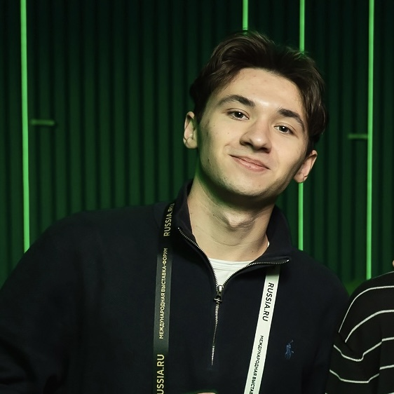
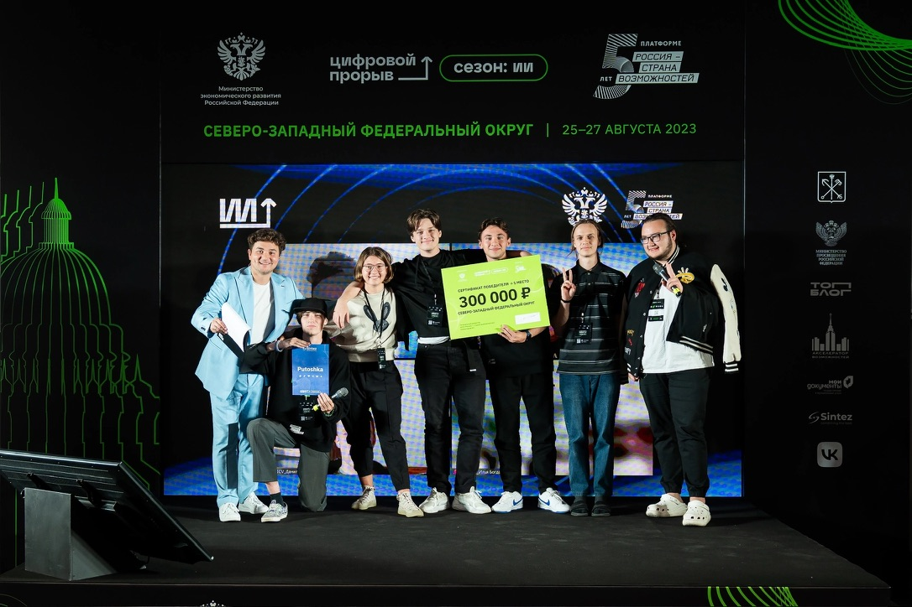
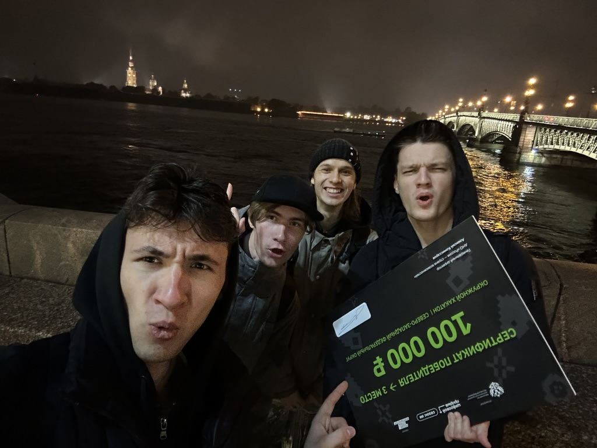
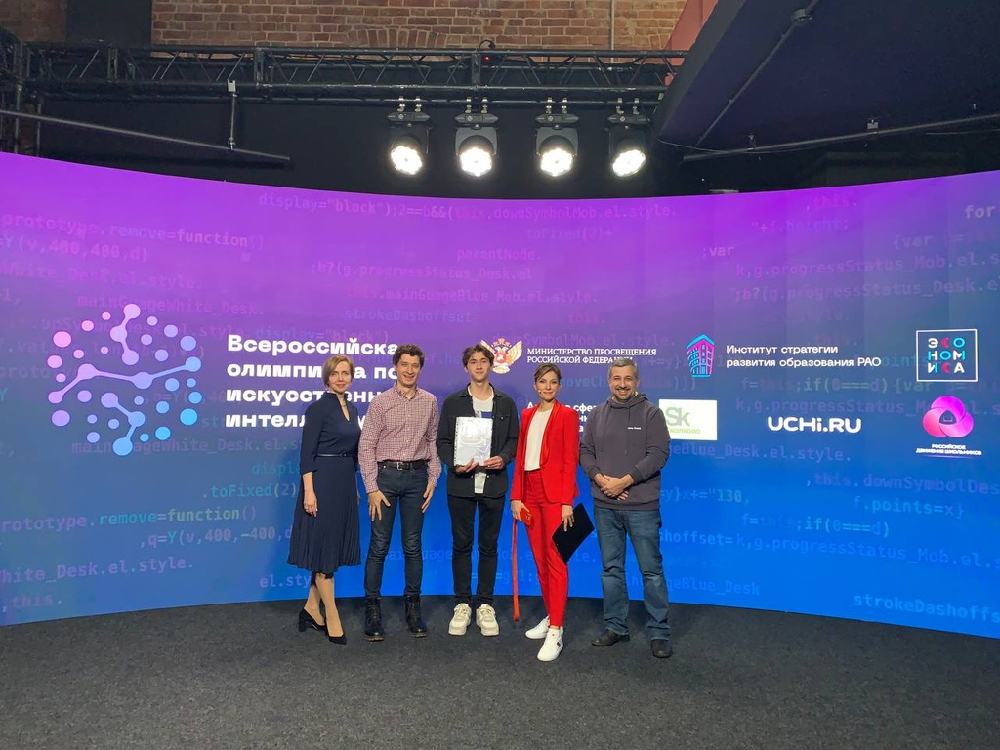
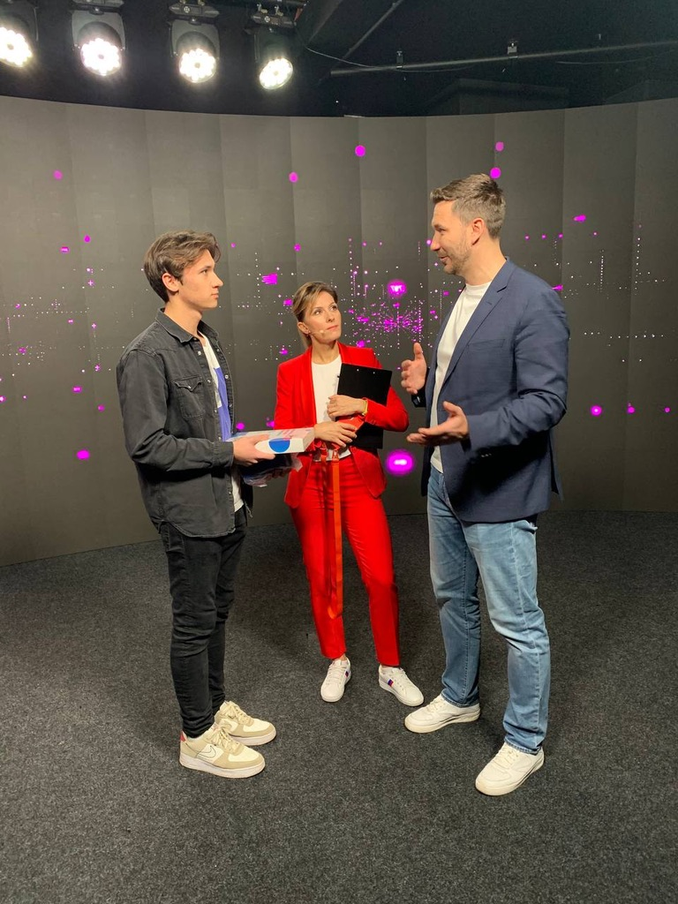
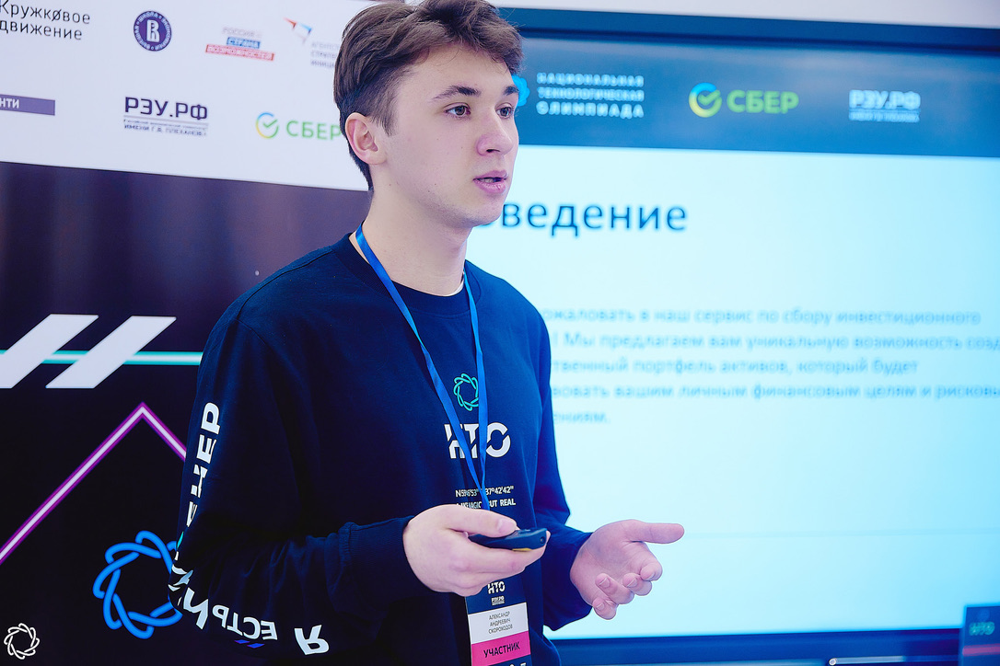
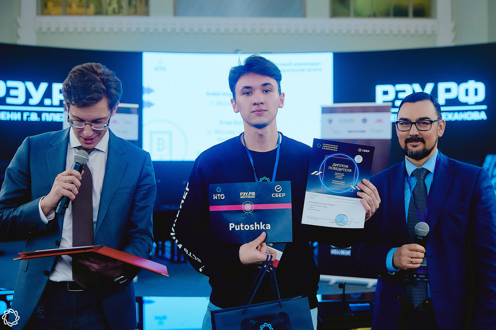
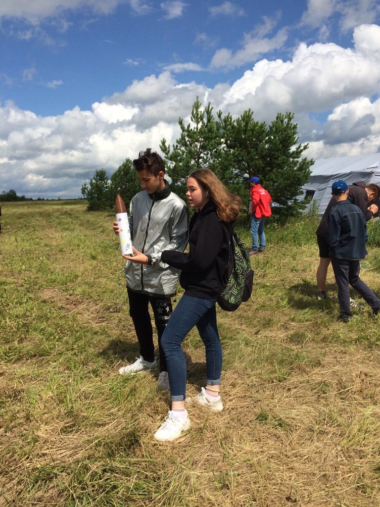
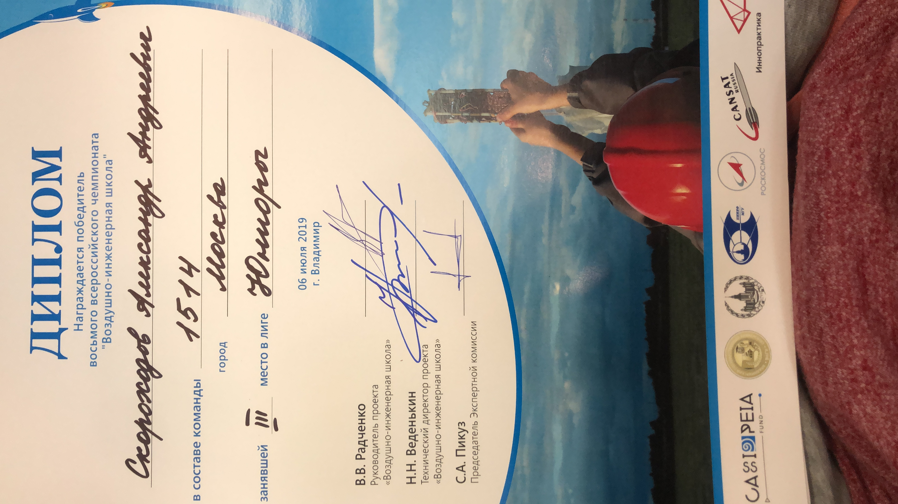

[//]: # ()

# Alexander Skorokhodov

**Backend Developer · Python · AI Systems**

I build backend systems for AI agents, real-time data processing and internal
business automation.

## About

I design and ship backend-heavy products where reliability, observability and
safe automation matter. My work spans secure browser-agent runtimes, exchange
data infrastructure and internal operations platforms.

## At a glance

<table>
<tr>
<td align="center"><b>200</b> browser actions per task</td>
<td align="center"><b>500+</b> market instruments</td>
<td align="center"><b>15</b> exchange integrations</td>
<td align="center"><b>30 → 5 min</b> reporting time</td>
</tr>
</table>

## Featured engineering work

### Secure Browser Agent Runtime

`Python` `asyncio` `FastAPI` `PostgreSQL` `Docker` `React`

Runtime for multi-step browser tasks executed in isolated Linux sessions.

- Supports tasks containing up to 200 browser actions
- Separates planning, execution, state, verification and recovery
- Provides human handoff for CAPTCHA, 2FA and sensitive actions
- Keeps credentials outside LLM context, logs and artifacts
- Uses evidence-backed completion checks

[Read the public architecture case study →](https://github.com/alexanderskorokhodov/secure-web-agent-architecture)

### Exchange Data Infrastructure

`TypeScript` `WebSocket` `Redis` `Redpanda` `PostgreSQL`

- Data ingestion for 500+ instruments across 15 exchanges
- Unified REST and WebSocket integration layer
- Rate limiting, retry/backoff and automatic reconnection
- Peak incoming traffic up to 300 Mbit/s
- Trading execution services for 8 exchanges

Production code is private; implementation details was provided in showcase.

[Read the public showcase →](https://github.com/alexanderskorokhodov/exchange-data-infrastructure-showcase)

### Internal Operations Platform

`Python` `FastAPI` `PostgreSQL` `React`

- Centralized work for 14 employees
- Processes 250–800 internal requests per month
- Models roles, statuses, transitions and deadlines
- Reduced status preparation from approximately 30 minutes to 5 minutes

## Hackathons & recognition

| Achievement | Result | Details / evidence                                                                                                                                                               |
|---|---|----------------------------------------------------------------------------------------------------------------------------------------------------------------------------------|
| **National Technology Olympiad** Financial Engineering · March 2023 | Winner | Winner of the Financial Engineering track at the National Technology Olympiad (NTO). [School announcement about the achievement →](https://lycu1580.mskobr.ru/edu-news/7597)  |
| **Digital Breakthrough AI** North-West Federal District · August 2023 | 1st place · team award of **₽300,000** | Project: Golf Trainer. Dates: 25–27 August 2023.                                                                                                                              |
| **Digital Breakthrough AI** North-West Federal District · October 2024 | 3rd place | Project: Laptop Defect Recognition & Moderation Platform. Computer-vision recognition of laptop defects with a platform for moderator review, validation and case management. |
| **All-Russian Olympiad in Artificial Intelligence** 6 December 2021 | 4th place in Russia · 1st place in Moscow | Invited to the official broadcast of the olympiad. [VK post about the result →](https://vk.ru/wall-181732473_796)                                                             |
| **Step into the Future** Computer Science · 2022 | Prize-winner | Recognition for achievement in computer science.                                                                                                                                 |
| **International Youth Scientific & Practical Congress “Oil and Gas Horizons”** | 1st place · technical section | Designed a local web application for an oil and gas company employee based on a **Lukoil** case. [VK post →](https://vk.ru/wall-181732473_1729)                               |
| **All-Russian Rocket Engineering Championship** Summer 2019 | 3rd place · Junior League | 8th All-Russian Championship “Air Engineering School”. 6 July 2019 · Vladimir · team 1514, Moscow.                                                                            |

Actively participated in hackathons and technology congresses, working on
practical cases for companies including **VK, Sber, Rosatom, Lukoil** and
**GeekBrains**.

## Stack

**Backend:** Python, FastAPI, asyncio, SQLAlchemy, PostgreSQL, Redis 
**Distributed systems:** Redpanda, WebSocket, REST API, Docker 
**Frontend:** TypeScript, React 
**AI systems:** LLM agents, MCP, browser automation, human-in-the-loop

## Social media

- [The future of finance is already here — LinkedIn post · 25K+ views](https://www.linkedin.com/posts/alexander-skorokhodov_ai-finance-trading-activity-7451962949247852544-WHD8?utm_source=share&utm_medium=member_desktop&rcm=ACoAAF7rcOcBvLWYf--vL6xgYpsk8BeoJFJOrzw)
- [The AI era for everything is ending — Threads post · 10K+ views](https://www.threads.com/@aa_skorohodov/post/DWQ_AXNjPKq?xmt=AQG0VB9z3NQU4L59Zar6afGMKZzDu2cBl3qXqACWcFm-Sg)

## Photo highlights

<table>
<tr>
<td colspan="2" align="center"></td>
</tr>
<tr>
<td colspan="2" align="center"><b>Digital Breakthrough AI · SZFO · 2023</b> Golf Trainer · 1st place</td>
</tr>
<tr>
<td align="center"></td>
<td align="center"></td>
</tr>
<tr>
<td colspan="2" align="center"><b>Digital Breakthrough AI · SZFO · 2024</b> Laptop defect recognition · 3rd place</td>
</tr>
<tr>
<td align="center"></td>
<td align="center"></td>
</tr>

<tr>
<td colspan="2" align="center"><b>All-Russian Olympiad in Artificial Intelligence · 2021</b> 4th place in Russia · 1st place in Moscow · invited to the official broadcast</td>
</tr>
<tr>
<td align="center"></td>
<td align="center"></td>
</tr>
<tr>
<td colspan="2" align="center"><b>National Technology Olympiad · Financial Engineering · 2023</b> Winner</td>
</tr>
<tr>
<td align="center"></td>
<td align="center"></td>
</tr>
<tr>
<td colspan="2" align="center"><b>All-Russian Rocket Engineering Championship · Summer 2019</b> 3rd place · Junior League</td>
</tr>
</table>

## Contact

For collaboration, backend architecture and AI-agent projects:

- [Telegram · @alexanderbtw](https://t.me/alexanderbtw)
- [LinkedIn · Alexander Skorokhodov](https://www.linkedin.com/in/alexander-skorokhodov/)
